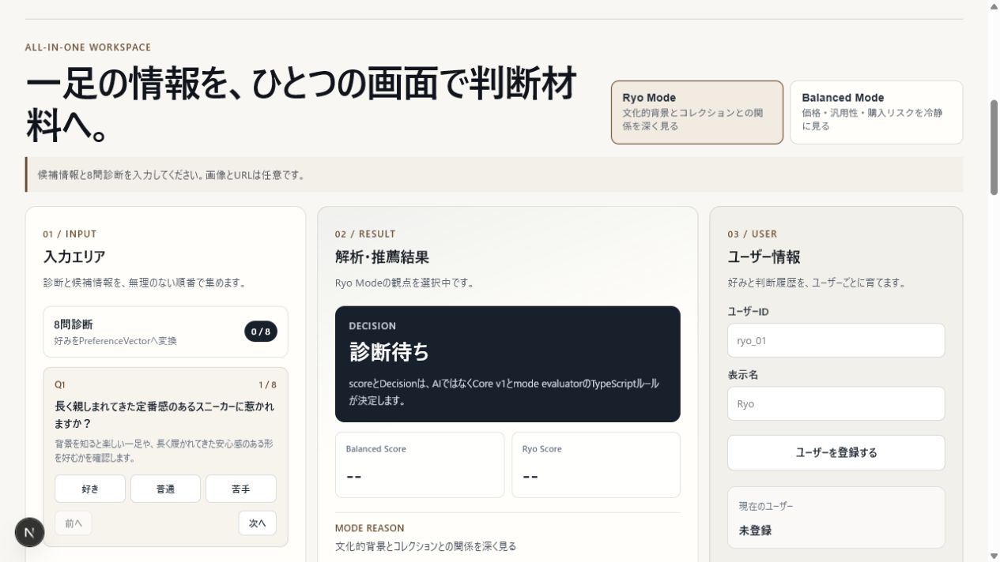
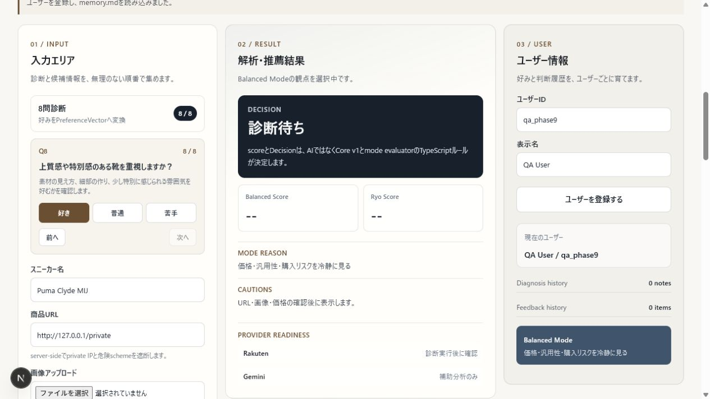
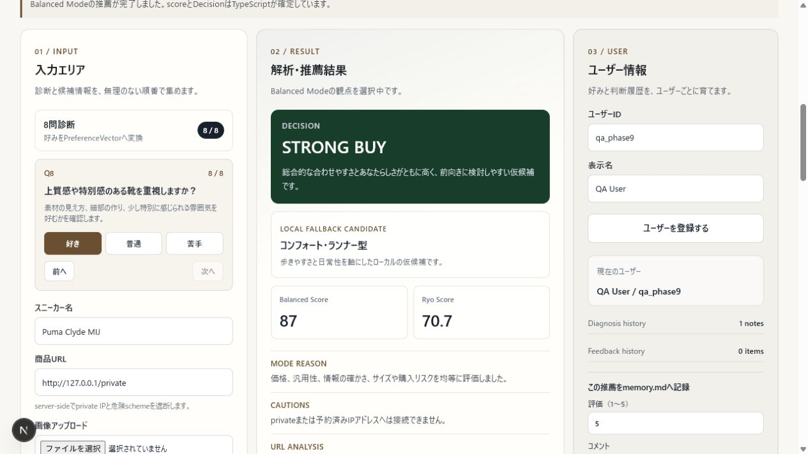

# SOLE//MATRIX Core v1

[](https://github.com/ryo-man03/sole-matrix-core/actions/workflows/ci.yml)

> **AI-powered sneaker recommendation platform.** Diagnosis, rule-based scoring, Gemini explanation, Rakuten readiness, and reproducible TypeScript Core.

[Release Notes v1.0.0](docs/releases/v1.0.0.md) · [Architecture](docs/core-v1-architecture.md) · [Security](docs/security/all-in-one-security.md)

SOLE//MATRIX は、気になるスニーカーの好み・商品URL・画像・予算・購入リスクを一画面で整理する判断支援プロトタイプです。PC版workspaceでは8問診断、Ryo Mode / Balanced Mode、URL・画像分析、楽天候補、ユーザーmemory、feedbackを一つの流れで扱います。

最終的なscoreとDecisionはTypeScriptが決定します。Geminiは説明と画像特徴抽出の補助、楽天APIは商品候補取得だけを担当します。外部APIが失敗してもlocal候補とrule-based explanationへfallbackします。

## Product Preview

### Top Screen



<table>
  <tr>
    <th>Diagnosis</th>
    <th>Recommendation Result</th>
  </tr>
  <tr>
    <td></td>
    <td></td>
  </tr>
  <tr>
    <th>Gemini Explanation</th>
    <th>Rakuten Readiness</th>
  </tr>
  <tr>
    <td></td>
    <td></td>
  </tr>
</table>

## 主な機能

- 8問回答を`PreferenceVector`の8軸へ変換
- PC向け3カラムUI（入力 / 解析・推薦結果 / user memory）
- `Ryo Mode`と`Balanced Mode`の切り替え
- スニーカー名、商品URL、JPEG / PNG / WebP画像、予算の入力
- SSRF対策済みserver-side URL meta抽出
- Gemini visionの定性的signalをTypeScriptでstructured JSONへ正規化
- local user profileと`data/users/{safeUserId}/memory.md`
- 診断履歴とfeedbackの永続化
- Ryo seedの所有モデル・wishlist・文化的背景参照
- 楽天候補のserver-side検索、正規化、readiness表示
- Gemini structured explanationまたはrule-based fallback

## 判断の流れ

```text
8問診断 + 名前 / URL / 画像 / 予算
  → URL meta analysis + image visual analysis
  → user memory（untrusted user data）+ Ryo seed
  → local候補 + 検証済み楽天候補
  → Core v1 Balanced / Ryo score
  → mode evaluatorが最終Decision
  → Gemini explanation または rule-based fallback
  → feedbackをmemory.mdへ保存
```

Ryo Modeは林諒馬の実所有41足と、重複行を統合したwishlist 40候補のseed v2を参照し、colorway、collaboration、製造背景、同一familyの重複を評価します。Balanced Modeは価格、汎用性、情報の確かさ、サイズ・プレ値などの購入リスクを重視します。

## セットアップ

Node.js、pnpm、Gitが必要です。

```bash
pnpm install
pnpm web:dev
```

通常は[http://localhost:3000](http://localhost:3000)で起動します。外部APIを設定しなくても推薦本線は動作します。

`.env.example`を`.env.local`へコピーし、必要な値だけ設定します。本物の値はcommitしません。

```env
GEMINI_API_KEY=your_api_key_here
RAKUTEN_APPLICATION_ID=your_application_id_here
RAKUTEN_ACCESS_KEY=your_access_key_here
BACKEND_API_BASE_URL=http://localhost:8787
RUN_EXTERNAL_SMOKE=
```

現在のNext.js一体構成では`BACKEND_API_BASE_URL`は省略できます。将来`server/`境界を別プロセスへ移す場合の接続先です。秘密値を`NEXT_PUBLIC_*`へ入れないでください。

## API

| Method / path | 用途 |
| --- | --- |
| `POST /api/users/register` | local user登録 / `memory.md`作成 |
| `GET /api/users/:userId/profile` | profile・履歴summary取得 |
| `POST /api/users/:userId/feedback` | feedback永続化 |
| `POST /api/sneakers/analyze` | 名前・URL・画像の統合分析 |
| `POST /api/recommendations/search` | mode-aware統合推薦 |
| `POST /api/core-v1/recommend` | 既存Core v1互換endpoint |

`/api/sneakers/analyze`は`multipart/form-data`で`sneakerName`、`url`、`image`を受け取ります。画像は5MB以下のJPEG / PNG / WebPだけを許可し、永続保存しません。

## URL分析の安全境界

- `http` / `https`以外、credential入りURL、非標準portを拒否
- localhost、private / link-local / reserved IPを拒否
- DNS解決結果と各redirect先を再検証
- 5秒timeout、redirect 3回、HTML 512KB上限
- title、description、Open Graph、canonicalだけを抽出
- cookie、API key、raw HTMLを送信・保存・表示しない
- 失敗時はURL情報なしで推薦を継続

## 画像分析とGeminiの役割

画像はMIME typeだけでなくmagic bytesも検証します。Geminiに許可するのはbrand / model推定、色、素材、シルエット、category、雰囲気、文化的文脈です。Geminiが返す定性的signal（none / low / medium / high）をTypeScriptがvisual scoreへ変換します。

Geminiは以下を決めません。

- 最終Decision
- Balanced / Ryo recommendation score
- 価格の真偽
- 真贋の断定

schema不一致、禁止field、通信失敗、設定不足ではstructured fallbackへ戻ります。説明生成でもCore確定済みfactsだけを渡し、`memory.md`は`untrusted_user_data`として明示します。

## 楽天候補とfallback

検索queryは名前・brand・color・URL name hint・診断tagから短く生成します。候補採用にはHTTP 200、JSON parse、shape validation、商品名、正の価格、安全なHTTPS URLが必要です。不正itemはrawのままUIやscoringへ渡しません。

| 状態 | 動作 |
| --- | --- |
| HTTP 200 + valid candidate | local候補と比較してTypeScriptでscore |
| `missing_config` | local候補で継続 |
| HTTP 403 | `blocked_forbidden`、local候補で継続 |
| HTTP 429 | `blocked_rate_limit`、local候補で継続 |
| 通信 / HTTP失敗 | `network_or_http_error`、local候補で継続 |
| invalid response | `invalid_response`、local候補で継続 |

## User memory

ユーザーIDは1〜64文字の英数字・ハイフン・アンダースコアだけを許可します。`../`、絶対path、空白、日本語ID、symlink境界を拒否します。runtime dataは`.gitignore`対象です。

```text
data/users/{safeUserId}/memory.md
```

自由文は制御文字と改行を正規化してJSON文字列として保存します。AIへ渡す場合もsystem instructionにはせず、ファイル内の命令文には従いません。

## 検証

通常検証は実ネットワークを呼びません。

```bash
pnpm exec vitest run
pnpm test
pnpm exec tsc --noEmit
pnpm web:build
```

lint scriptと独立server build scriptは現在ありません。`server/**/*.ts`はTypeScriptとNext production buildで検証します。外部smokeは`RUN_EXTERNAL_SMOKE=1`の明示opt-in時だけ実行します。

```powershell
$env:RUN_EXTERNAL_SMOKE = "1"
pnpm exec vitest run app/_lib/external-smoke app/_lib/core-v1/geminiActualSmoke.test.ts --disableConsoleIntercept --reporter=verbose
Remove-Item Env:RUN_EXTERNAL_SMOKE -ErrorAction SilentlyContinue
```

値、request URL、query全文、raw responseは出力しません。

## 主なディレクトリ

```text
app/_components/RecommendationWorkspace.tsx   PC版統合UI
app/_lib/core-v1/                             score / Decision / providers
app/_lib/url-analysis/                        safe URL analysis
app/_lib/image-analysis/                      image validation / vision adapter
app/_lib/user-memory/                         memory.md persistence
app/_lib/integrated-recommendation/           mode-aware orchestration
app/_lib/apiClient.ts                         frontend API boundary
app/api/                                      Next.js transport routes
server/routes/                                backend route boundary
server/services/                              backend service boundary
data/users/                                   ignored runtime user data
```

設計と検証の詳細は[architecture](docs/core-v1-architecture.md)と[security notes](docs/security/all-in-one-security.md)を参照してください。

## 画面証跡

Phase 9 / 10で更新するPC版証跡:

- `docs/screenshots/all-in-one-top.png`
- `docs/screenshots/all-in-one-balanced-mode.png`
- `docs/screenshots/all-in-one-inputs.png`
- `docs/screenshots/all-in-one-recommendation.png`
- `docs/screenshots/all-in-one-user-memory.png`
- `docs/screenshots/all-in-one-ryo-image.png`

既存Core v1の証跡も`docs/screenshots/`に残しています。

## 制限

- local user登録は認証ではありません
- 楽天候補は在庫・真贋・市場価格を保証しません
- 画像からのbrand / model名は推定であり、真贋判定ではありません
- 別server化は境界までで、現在はNext.js process内です
- Core v0.1 / v1の既存API、CLI、golden testsは維持しています

```bash
pnpm demo
pnpm demo:gemini
```
