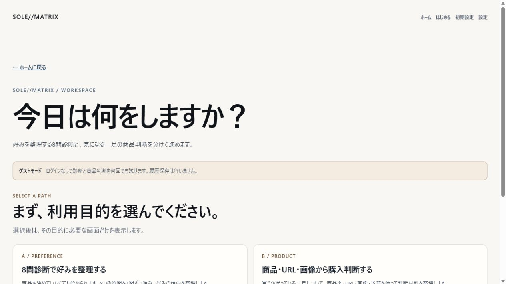
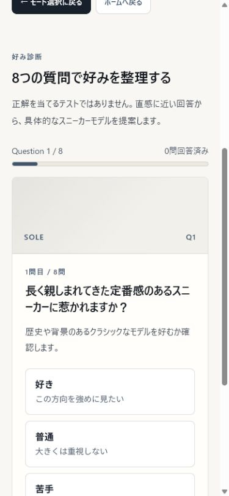
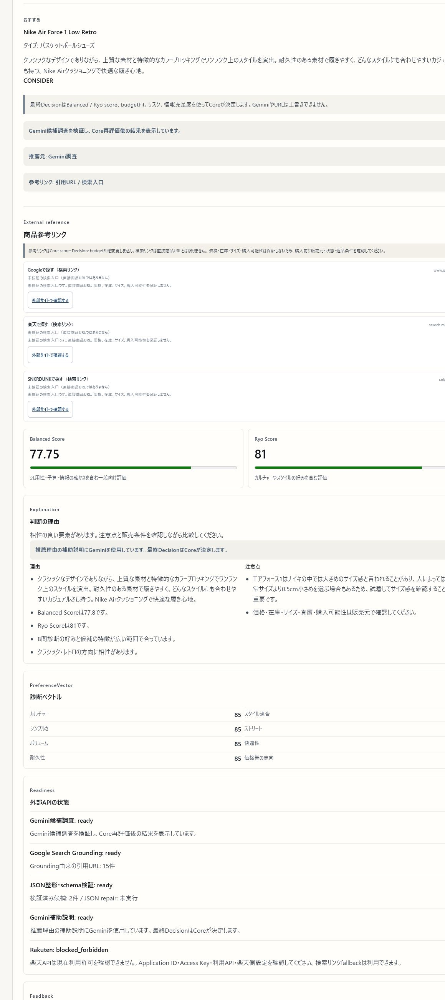
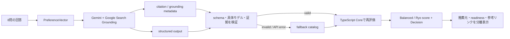

# SOLE//MATRIX

**好みを言葉にし、気になる一足を「なんとなく」ではなく比較できる形にする。**

SOLE//MATRIXは、8問の好み診断と商品情報からスニーカー選びを補助するNext.jsアプリです。Geminiは実在候補の調査と説明を担当し、スコア・予算適合度・最終Decisionは決定論的なTypeScript Coreが担当します。

> AIは候補を広げる。Coreは判断を固定する。外部リンクは確かめる入口であって、購入可能性の保証ではない。

## Screenshots

### PC — 目的から選ぶワークスペース



8問診断と、商品名・URL・画像を使う購入判断を最初から分けています。ログインなしのゲストモードでも、主要な体験を何度でも試せます。

### Smartphone — 1問ずつ進む8問診断

<p align="center">
  
</p>

スマホでは質問、回答、進捗を縦方向に集約します。「好き・普通・苦手」だけで進められ、商品名を知らなくても診断を始められます。

### Actual result — Gemini候補調査 + Core再評価



2026-07-03に実APIと実画面で確認した例です。Gemini候補調査をschema検証し、Coreで再評価した結果として `Nike Air Force 1 Low Retro` を表示しています。画面上で推薦元、引用URL／検索入口、Core Decisionを区別できます。候補は診断回答や外部APIの応答によって変わります。

## このプロジェクトの思想

### 1. AIを「決定者」にしない

生成AIは、実在候補の探索や自然な説明を得意とします。一方で、同じ入力に常に同じ判断を返すことや、アプリ固有の評価ルールを厳密に守ることは別の問題です。

SOLE//MATRIXでは役割を分けています。

- Gemini: 候補調査、根拠となるcitation、推薦理由・注意点の補助説明
- TypeScript Core: PreferenceVector、Balanced / Ryo score、budgetFit、リスク、最終Decision
- UI: どの処理が成功し、何がfallbackしたかを隠さず表示

Geminiの文章、URL、confidenceだけでCoreのスコアやDecisionが変わることはありません。

### 2. 「証拠」と「判断」を混ぜない

楽天listing、URL metadata、画像解析、Gemini citationは、確認や比較に使う外部証拠です。これらを直接スコアへ加点すると、APIの応答有無で判断が揺れたり、リンクがあるだけで高評価になったりします。

そのため外部証拠は表示と説明に使い、Core scoreへの影響は `none` に固定しています。

### 3. fallbackを成功に見せない

Gemini候補調査とGemini補助説明は別々の機能です。補助説明だけが成功しても、候補調査成功とは表示しません。

- 候補調査成功: `candidateResearch.source === "gemini"`
- 候補調査失敗: 具体モデルを持つアプリ内catalogへfallback
- 補助説明失敗: rule-based説明へfallback

Coreが具体モデル名から作る検索入口URLは参考リンクとして利用できますが、そのURLだけでGemini調査成功にはしません。

### 4. 購入を断定しない

Decisionは比較のための判断材料です。価格、在庫、サイズ、真贋、購入可能性は保証しません。検索リンクも直接商品URLとは限らないため、購入前に販売元、状態、返品条件を確認する前提で設計しています。

## 体験できること

- 8問診断から8軸のPreferenceVectorを作成
- 実在する具体的なスニーカーモデルをGemini + Google Search Groundingで調査
- Ryo Mode / Balanced Modeの2視点でCore再評価
- 商品名・URL・画像から一足の購入判断を整理
- Gemini候補調査とGemini補助説明のreadinessを個別表示
- Google・楽天・SNKRDUNKの具体モデル検索入口を生成
- Geminiや外部APIの失敗時も、具体モデルcatalogとrule-based説明で継続
- Supabase設定時のsignup / signin / session / logout
- 保存しない無制限ゲストモード

## 推薦ができるまで



### Gemini candidate research

Gemini 2.5では、調査とJSON整形を2段階に分けています。

1. Google Search Groundingで実在候補と `groundingMetadata` を取得
2. 調査メモを `responseMimeType: application/json` + `responseSchema` で整形
3. JSON parseとアプリ側schema validationを実行
4. 具体モデル名とcitationの対応を確認
5. Core候補へ変換し、再スコアリング

JSON本文にGeminiが書いただけのURLは証拠として採用しません。採用するのはGrounding metadata由来のcitationと、表示補助としてCoreが生成した具体モデル検索入口です。JSONが壊れた場合は、意味やfieldを追加しない構文repairを1回だけ許可します。

`candidateResearch.source === "gemini"` になるのは、API呼び出し、JSON parse、schema validation、具体モデル判定、citation確認、Core再評価をすべて通過した場合だけです。

### Readiness表示

UIでは次を独立して表示します。

- Gemini候補調査: `ready / fallback / error`
- Google Search Grounding: `ready / fallback / error / not_checked`
- JSON整形・schema検証: `ready / fallback / error / not_checked`
- Gemini補助説明: `ready / fallback / error`
- 推薦元: `gemini / fallback_catalog`
- 参考リンク: `gemini_citation_url / direct_product_url / search_entry_url`

主なfallback reasonCodeは `missing_api_key`、`rate_limited`、`api_error`、`timeout`、`invalid_json`、`schema_invalid`、`no_candidates`、`no_evidence_url`、`model_name_too_abstract`、`core_reevaluation_failed` です。

## 使い方

1. `/login`でログイン、新規登録、または「ゲストで試す」を選びます。
2. `/app`で「8問診断」または「商品・URL・画像から購入判断」を選びます。
3. 8問診断では各質問に「好き・普通・苦手」で回答します。
4. 任意で予算を入力し、推薦結果を生成します。
5. 具体モデル、Decision、理由、注意点、推薦元、外部API状態、参考リンクを確認します。

ゲストの診断、商品入力、画像、履歴は保存しません。

## セットアップ

```powershell
npx --yes pnpm@11.5.2 install
Copy-Item .env.local.example .env.local
npx --yes pnpm@11.5.2 web:dev
```

`.env.local`へ必要なサービスだけ設定します。実際のAPIキーはREADME、ログ、commitへ残さないでください。

```env
GEMINI_API_KEY=
GEMINI_RESEARCH_MODEL=gemini-2.5-flash
GEMINI_RESEARCH_FALLBACK_MODEL=
RAKUTEN_APPLICATION_ID=
RAKUTEN_ACCESS_KEY=
RUN_EXTERNAL_SMOKE=
SUPABASE_URL=
SUPABASE_ANON_KEY=
NEXT_PUBLIC_SUPABASE_URL=
NEXT_PUBLIC_SUPABASE_ANON_KEY=
```

外部サービスが未設定でもゲスト主動線は動作します。Gemini未設定時は候補catalogとrule-based説明、Rakuten失敗時は具体モデル検索入口へ切り替わります。

## 検証

```powershell
npx --yes pnpm@11.5.2 typecheck
npx --yes pnpm@11.5.2 test
npx --yes pnpm@11.5.2 web:build
```

実API smokeは明示的にopt-inした場合だけ実行します。

```powershell
$env:RUN_EXTERNAL_SMOKE = "1"
npx --yes pnpm@11.5.2 exec vitest run app/_lib/ai/geminiSneakerResearchActual.test.ts app/_lib/external-smoke app/_lib/core-v1/geminiActualSmoke.test.ts --disableConsoleIntercept --reporter=verbose
Remove-Item Env:RUN_EXTERNAL_SMOKE -ErrorAction SilentlyContinue
```

直近の検証（2026-07-02）:

- `typecheck`: 成功
- `test`: 55 files / 395 tests 成功
- `web:build`: 成功
- Gemini candidate research実API smoke: 成功
- PC 1280×720 / mobile 390×844の実画面確認: 成功
- 実画面でGemini候補調査 `ready`、Gemini補助説明 `ready`、推薦元 `Gemini調査` を確認

実API未実行、missing config、network error、rate limit、fallback状態を成功として報告しない方針です。キー値、生レスポンス、secretを含むURLは出力しません。

## 技術スタック

- Next.js 16 / React 19 / TypeScript
- Gemini GenerateContent REST API
- Google Search Grounding + structured output
- Vitest
- Supabase Auth（optional）
- Rakuten Product Search（optional）

## 主要ディレクトリ

```text
app/_lib/ai/                          Gemini候補調査・schema・fallback catalog
app/_lib/core-v1/                     Core score・Decision・Gemini説明・readiness
app/_lib/external-evidence/           外部証拠の正規化境界
app/_lib/product-links/               具体モデル名ベースの参考リンク
app/_lib/auth-session/                guest session・Supabase Auth境界
app/_components/                      診断・商品判断・結果UI
app/api/                              server-side API routes
src/                                  ドメイン・Coreロジック・CLI demo
docs/product/SUBMISSION_READINESS.md   提出前の検証境界
docs/product/screenshots/readme/       README掲載スクリーンショット
```

## 現在の制約

- 価格・在庫・サイズ・真贋・購入可能性は保証しません。
- Gemini、Rakuten、Supabaseの可用性は環境と外部サービスに依存します。
- Supabase未設定時は認証を無効化し、ゲストモードを維持します。
- ログインユーザーの診断メモとfeedbackは現時点ではローカルuser-memory APIが保存入口で、Supabase DB永続化ではありません。
- 検索入口は未検証リンクであり、直接商品URLではありません。

---

SOLE//MATRIXは「AIに選んでもらう」ためではなく、自分の好みと判断理由を見える形にして、納得できる一足を比較するためのプロジェクトです。
