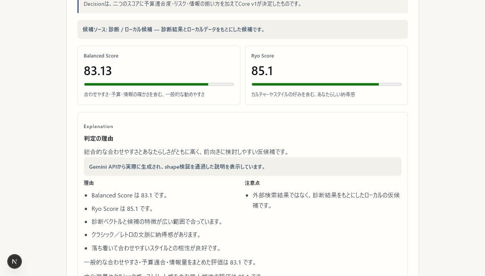
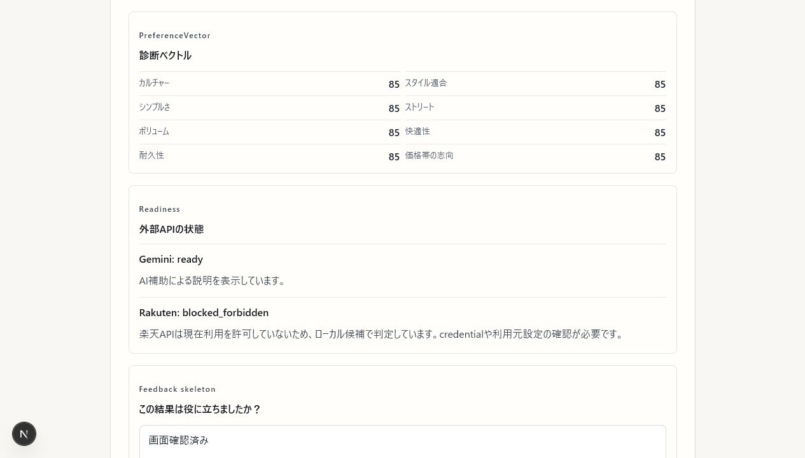
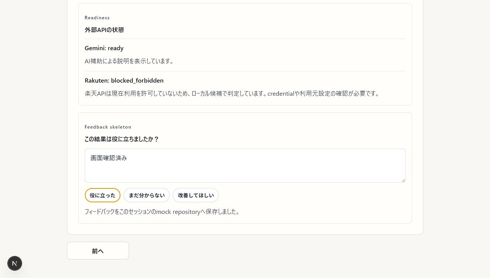

# SOLE//MATRIX Core v1

[](https://github.com/ryo-man03/sole-matrix-core/actions/workflows/ci.yml)

SOLE//MATRIX は、スニーカーを買う前の「似合う」「使いやすい」「自分らしい」を分けて考える判断支援プロトタイプです。8問の好み診断から推薦候補を比較し、二つのスコア、最終Decision、理由と注意点まで一つの画面で確認できます。

Core v1ではscoreとDecisionをTypeScriptの決定論的なロジックが確定します。Geminiは確定結果の説明だけを担当し、楽天市場の商品データはserver-side providerで検証・正規化できた場合だけ候補として使います。どちらの外部APIが利用できなくても、ローカル候補とrule-based explanationで最後まで動作します。

## できること

- 診断回答と対応タグを8軸の`PreferenceVector`へ変換
- 一般的な勧めやすさを表すBalanced Scoreを計算
- カルチャーや個人の好みを重視するRyo Scoreを計算
- 予算適合度、リスク、情報量を加味してDecisionを決定
- Gemini structured outputまたはrule-based fallbackで理由を説明
- 楽天APIがHTTP 200かつshape-validの場合だけ商品候補を利用
- `403`、`429`、設定不足、通信失敗、不正レスポンスをreadinessとして表示
- Feedbackをmock repositoryへ保存（永続化前のskeleton）

## 画面の流れ

```text
8問の好み診断
  → PreferenceVector（0〜100の8軸）
  → ローカル候補 + 検証済み楽天候補
  → Balanced Score / Ryo Score
  → TypeScript CoreがDecisionを確定
  → Gemini explanation または rule-based fallback
  → Recommendation UI
  → Feedback API skeleton
```

PreferenceVectorは`culture / styleFit / simplicity / street / volume / comfort / durability / priceLevel`の8軸です。Decisionは`strong_buy / consider / wait / avoid / unknown`のいずれかです。

## セットアップ

Node.js、pnpm、Gitが必要です。

```bash
pnpm install
pnpm web:dev
```

開発サーバーは通常[http://localhost:3000](http://localhost:3000)で起動します。外部APIなしでも診断、推薦、説明、Feedback skeletonを確認できます。

## 環境変数

`.env.example`を`.env.local`の雛形として使います。本物の値はcommitしません。すべてserver sideで読み込み、`NEXT_PUBLIC_*`にはしません。

```env
GEMINI_API_KEY=
RAKUTEN_APPLICATION_ID=
RAKUTEN_ACCESS_KEY=
RUN_EXTERNAL_SMOKE=
SUPABASE_URL=
SUPABASE_ANON_KEY=
```

`SUPABASE_*`は将来のFeedback永続化用で、現時点の動作には不要です。

## API

### Recommendation

`POST /api/core-v1/recommend`

```json
{
  "diagnosisAnswers": {
    "trusted-classic": "like",
    "simple-daily": "neutral"
  },
  "preferenceTags": ["classic", "minimal"],
  "budgetYen": 20000
}
```

診断回答または対応タグが1つ以上必要です。予算は任意です。Route Handlerからserver-side providerを呼び、外部候補をraw responseのままUIやscoringへ渡しません。

### Feedback skeleton

`POST /api/core-v1/feedback`

```json
{
  "recommendationId": "core-v1:local-classic-daily",
  "sentiment": "helpful",
  "comment": "理由が分かりやすかった"
}
```

`sentiment`は`helpful`、`not_helpful`、`unsure`のいずれかです。現在はprocess内のmock repositoryへ保存するため、再起動すると消えます。認証、Supabase本番接続、feedback学習はまだ行いません。

## Geminiの役割

Geminiへ渡すのは、Coreが計算済みのDecision、Balanced/Ryo Score、理由、warning、readiness、タグ、予算、安全な候補要約だけです。Geminiはscore、Decision、budgetFit、risk、楽天候補の採否を決めません。

返却値は次のstructured JSONとして検証します。

```ts
type GeminiExplanationJson = {
  summary: string;
  reasons: string[];
  cautions: string[];
  balancedView: string;
  ryoView: string;
  finalTone: "positive" | "balanced" | "cautious" | "negative" | "unknown";
};
```

APIキー未設定、HTTP/通信エラー、JSON不正、schema不一致、安全でない表現はすべてrule-based explanationへfallbackします。APIキーはURLへ含めずrequest headerで送ります。raw response、prompt全文、request URLは表示・保存・ログ出力しません。

## 楽天候補とfallback

楽天市場商品検索APIは`app/_lib/core-v1/rakutenProvider.ts`だけから呼びます。`formatVersion=2`の応答を純粋関数のnormalizerで検証し、名前・正の価格・HTTPS URLが安全に揃った候補だけを`source: "rakuten"`として利用します。正規化済み価格がある場合だけ予算適合度の補助に使います。

| 状態 | Core v1の動作 |
| --- | --- |
| HTTP 200 + shape valid | 正規化済み楽天候補をローカル候補と比較 |
| 設定不足 | `missing_config`、ローカル候補で継続 |
| HTTP 403 | `blocked_forbidden`、ローカル候補で継続 |
| HTTP 429 | `blocked_rate_limit`、ローカル候補で継続 |
| その他HTTP/通信失敗 | `network_or_http_error`、ローカル候補で継続 |
| HTTP 200 + invalid shape | `invalid_response`、ローカル候補で継続 |

## 検証

通常検証は実ネットワークを呼びません。

```bash
pnpm exec vitest run
pnpm test
pnpm exec tsc --noEmit
pnpm web:build
```

ESLintは未導入のため、現在の`package.json`にlint scriptはありません。大きな依存追加は行わず、Vitest、TypeScript、Next.js production buildを必須ゲートにしています。

### Gemini actual-generation smoke

外部smokeは明示的に`RUN_EXTERNAL_SMOKE=1`を設定したときだけ実APIへ接続します。PowerShellでは値を表示せず`.env.local`をprocess envへ読み込んでから実行します。

```powershell
Get-Content .env.local | ForEach-Object {
  if ($_ -notmatch '^\s*(#|$)') {
    $name, $value = $_ -split '=', 2
    if ($name -and $value) { [Environment]::SetEnvironmentVariable($name.Trim(), $value.Trim(), 'Process') }
  }
}
$env:RUN_EXTERNAL_SMOKE = '1'
pnpm exec vitest run app/_lib/core-v1/geminiActualSmoke.test.ts --disableConsoleIntercept --reporter=verbose
```

成功時は本文ではなく`shapeValid`、`summaryNonEmpty`、`reasonsCount`、`cautionsIsArray`、`source`、`decisionSource`だけを出力します。`GEMINI_API_KEY`がなければ`missing_env`としてネットワークを呼びません。

楽天の隔離readiness smokeは次で実行します。

```powershell
pnpm exec vitest run app/_lib/external-smoke --disableConsoleIntercept --reporter=verbose
```

smoke後は必要に応じてprocess envから`RUN_EXTERNAL_SMOKE`、`GEMINI_API_KEY`、`RAKUTEN_APPLICATION_ID`、`RAKUTEN_ACCESS_KEY`を削除してください。

## 主なディレクトリ

```text
app/_lib/core-v1/
  diagnosis / preferenceVector / scoring / decision
  explanation / geminiExplanation / geminiActualSmoke
  rakutenProvider / rakutenNormalizer / rakutenReadiness
  service / repository / validation

app/api/core-v1/
  recommend / feedback Route Handlers

app/_components/CoreV1RecommendationPanel.tsx
  Recommendation UI / source / readiness / feedback skeleton

src/core/
  既存recommendSneakers公開API（維持）
```

詳しい境界と画面確認手順は[docs/core-v1-architecture.md](docs/core-v1-architecture.md)を参照してください。

## 画面証跡

実APIを有効にしたローカルQAで、推薦結果、外部API readiness、Feedback保存を確認しています。







## 現在の制限と今後

- 楽天候補は検索結果であり、在庫・真贋・市場価格の保証はしない
- Feedbackはprocess内mockで、永続化・認証・学習は未実装
- Supabase本番接続、RLS運用、市場価格監視は今後の拡張
- 検索入力型UIは補助レーンで、別のDecisionロジックを持たない

既存Core v0.1の`recommendSneakers`、サンプルデータ、CLI demo、golden testは維持しています。

```bash
pnpm demo
pnpm demo:gemini
```
