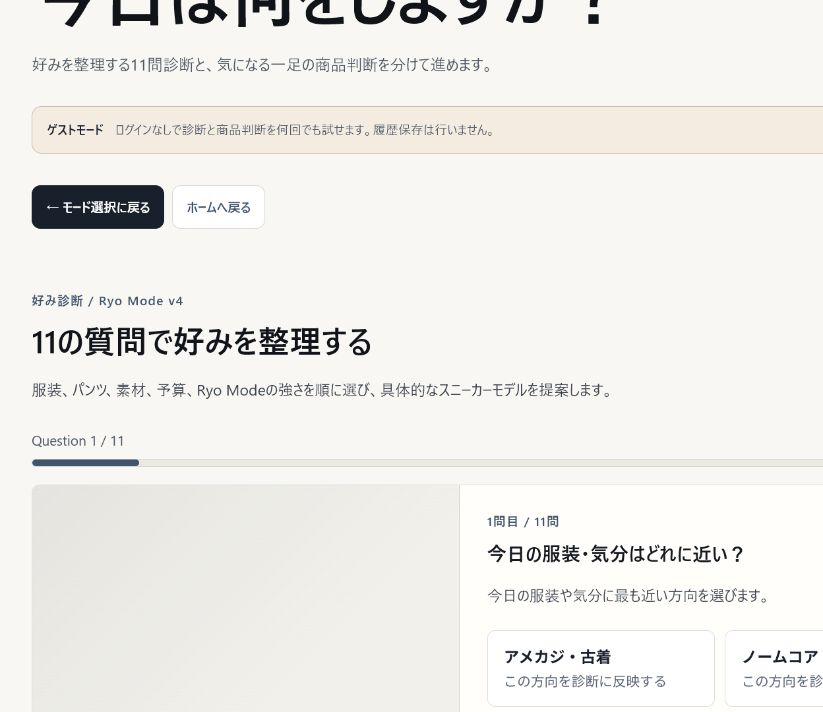
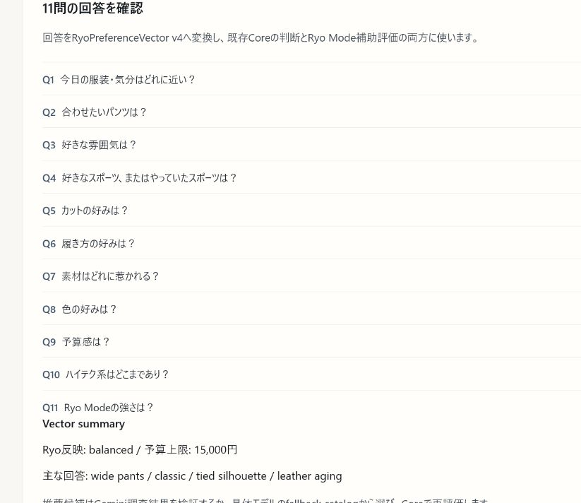
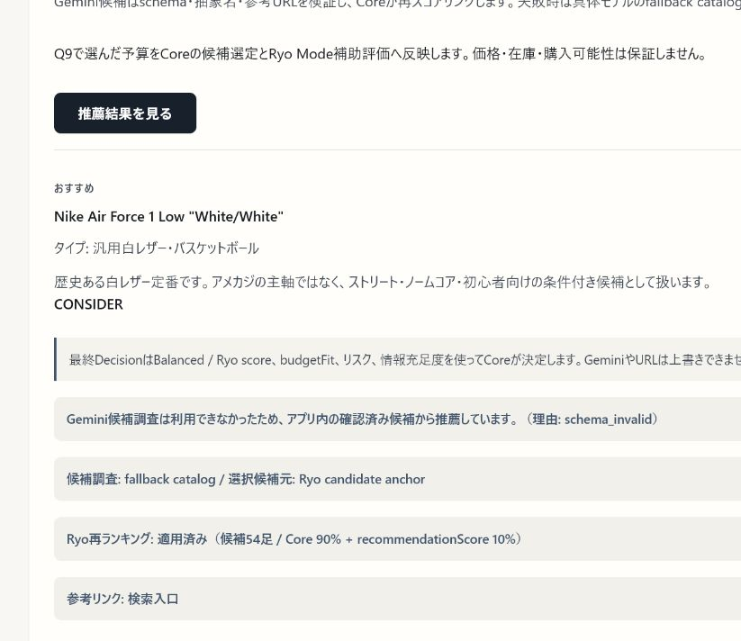
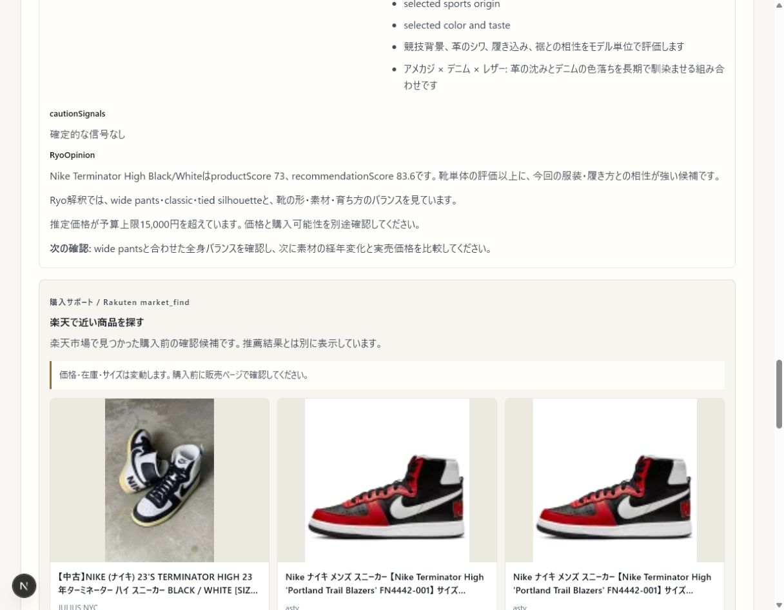
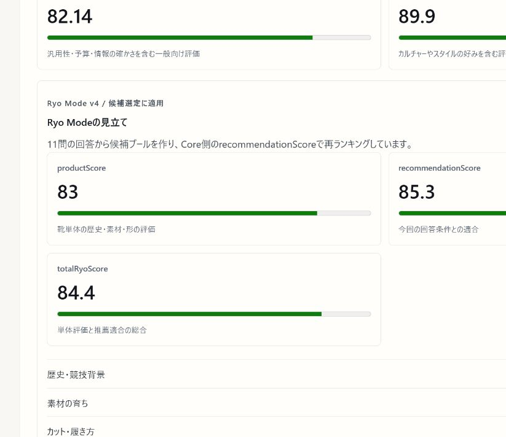
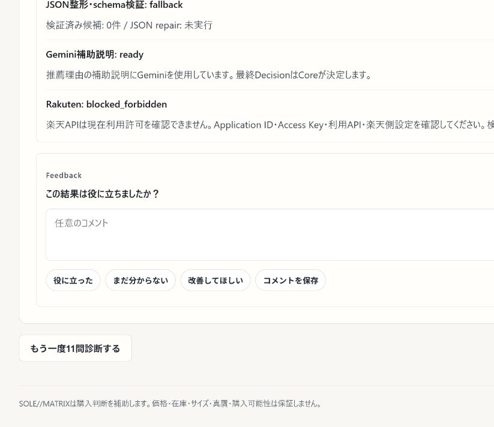

# SOLE//MATRIX

スニーカーを、流行や価格だけでなく、歴史・素材・服との相性・文化背景まで含めて整理し、購入判断を補助する Web アプリです。

商品名・URL・画像からの単体判断と、11問診断にもとづく推薦を分けて扱い、Gemini の候補調査、TypeScript Core / Ryo Mode の推薦判断、Rakuten `market_find` の購入サポートを明確に分離しています。価格、在庫、サイズ、購入可能性は販売元での確認を前提にしています。

## 1. Overview

SOLE//MATRIX は、好みを言語化しにくい人でも、服装・パンツ・素材・予算・カルチャーの軸でスニーカー選びを整理できるように設計したアプリです。

- 11問診断から `RyoPreferenceVector v4` を生成できる
- 商品名・URL・画像から個別の商品判断ができる
- Gemini を候補調査と補助説明に使い、Core が schema 検証・fallback・再ランキング・最終判断を担う
- Ryo Mode v4 で文化背景、素材の育ち、パンツ相性を強く反映する
- Rakuten `market_find` で、推薦後に楽天市場の購入候補を別枠で探せる
- 価格・在庫・サイズ・購入可能性は販売元で要確認

## 2. Screenshots

以下は、2026-07-07 にローカル環境で確認した画面です。実 API に依存しない確認用キャプチャを含みます。

### 11問診断の開始画面



### 回答サマリー



### 推薦結果のメイン画面



### Rakuten market_find の購入サポート

修正後の High 条件に合う推薦を維持したまま、楽天市場の購入候補を別枠で表示します。外部 API が利用できない場合は soft error と再試行導線へ切り替わります。



### Ryo Mode v4 の score 表示



### フィードバック保存 UI



## 3. Why I built this

私は中学生の頃からスニーカーが好きで、ただ新しいモデルや高いモデルを追うよりも、「なぜその靴が生まれたのか」「どんな人や文化に履かれてきたのか」「履き込んだ後にどう育つのか」を考えて選ぶことが多くありました。

一方で、スニーカー選びは情報量が多く、流行・価格・ブランド名だけで判断すると、自分の服装や履き方に合わないことがあります。そこで、感覚だけで終わらせず、歴史・素材・服装・予算・文化背景から判断を整理できるアプリを作りたいと考えました。

SOLE//MATRIX は、AI におすすめを丸投げするためのアプリではありません。Gemini で候補調査や補助説明を行いつつ、最終的な評価や再ランキングは Core 側で制御し、ユーザーの好みと実際の購入判断に近づけることを目指しています。

## 4. Main features

- 11問診断
- 商品判断（商品名 / URL / 画像）
- `RyoPreferenceVector v4`
- `productScore` / `recommendationScore` / `totalRyoScore`
- cultural recommendation metadata
- retro running taxonomy
- Gemini grounded candidate research
- fallback catalog
- Rakuten `market_find` purchase-support layer
- feedback localStorage persistence

## 5. Ryo Mode v4

Ryo Mode v4 は、古い型、復刻、素材の育ち方、パンツ相性、文化背景を重視する推薦補助レイヤーです。

Ryo Signature Layer は、既存の候補評価の後段で Ryo Mode の再ランキングを補正します。定番モデルを禁止するのではなく、アメカジ、素材の経年変化、復刻や文化背景を強く求める回答では、Tobacco、Terminator、Converse J / VTG 系、New Balance 998 のような文脈のある隣接候補が上がりやすくなる一方、初心者・シンプル・実用重視の回答では安全牌の推薦を残します。

- `parent model`
  Converse One Star、All Star J / VTG、Jack Purcell、PUMA Suede / Clyde、Vans、New Balance 991 / 998 / 1500 などの親モデル軸を持つ
- `style template`
  アメカジ、ノームコア、きれいめ、ストリートなどの服装文脈を反映する
- `pants template`
  デニム、ワークパンツ、ストレート、ワイド、スラックスなどとの相性を見る
- `material template`
  レザーのシワ、スエードの毛並み、キャンバスの退色など、履き込んだ後の表情を評価に入れる
- `retro-running`
  70s / 80s / premium retro runner / modern retro / high-tech running を分けて扱う

`productScore` は靴単体の魅力、`recommendationScore` は今回の回答条件との適合、`totalRyoScore` はその総合です。

AF1 は完全に排除していません。白レザー定番として機能する文脈では残しつつ、アメカジ Ryo Strong の主軸としては扱わない設計です。ハイテク系も別軸として評価し、Ryo classic と同一視しないようにしています。

## 6. Core / Ryo Mode / Gemini / Rakuten の役割

Ryo Mode は汎用的な AI プロンプトではなく、11問の回答を構造化した preference vector と、親モデル・文化背景・素材・パンツ相性などのルールを使う推薦ロジックです。Gemini は Google Search Grounding を使った候補調査と補助説明を担当しますが、出力はそのまま採用せず、Core 側で schema と内容を検証します。fallback catalog は Gemini 成功扱いにしません。

Rakuten `market_find` は推薦後の購入サポートです。楽天の商品情報は Core / Ryo Mode のスコア、ランキング、最終 Decision を変更しません。また、公式モデル同定、正規品判定、価格・在庫・サイズの保証には使いません。

| Role | Responsibility |
| --- | --- |
| Preference / recommendation logic | TypeScript Core / Ryo Mode v4 |
| Grounded candidate research / explanation support | Gemini / Google Search Grounding |
| Validation / schema / fallback / final decision | TypeScript Core |
| Purchase-support product search | Rakuten `market_find` |
| Feedback persistence | UI / localStorage |

## 7. Scoring structure

| Field | Meaning |
| --- | --- |
| `productScore` | 靴単体の歴史・素材・形の評価 |
| `recommendationScore` | 今回の回答条件との適合 |
| `totalRyoScore` | 単体評価と推薦適合の総合 |
| `parentModelAffinity` | 親モデルとの文化的な軸の近さ |
| `templateAffinity` | 服装テンプレートとの一致度 |
| `retroRunningAffinity` | レトロランニング文脈との一致度 |
| `materialAffinity` | 素材の育ち方や経年変化との相性 |
| `pantsAffinity` | パンツとの合わせやすさ |

## 8. Tech stack

- Next.js 16
- React 19
- TypeScript
- Vitest
- Gemini GenerateContent REST API
- Google Search Grounding
- Rakuten Ichiba Item Search API

## 9. What I focused on

- AI 出力を鵜呑みにしないこと
- Gemini と Core の責務分離を README 上でも明確にすること
- Rakuten を推薦ロジックから分離し、購入サポートとして扱うこと
- 11問診断を構造化して `RyoPreferenceVector v4` へ変換すること
- 歴史・文化・素材・パンツ相性を recommendation logic に落とし込むこと
- feedback をブラウザ側で保存し、見返せる導線を用意すること
- 実装されている内容と README の説明を一致させること

## 10. Limitations

- Gemini の Grounding は候補調査の根拠を補いますが、情報の完全性や恒久的な正確性を保証するものではありません。候補は Core で検証し、失敗時は具体モデルの fallback catalog を使います。
- Rakuten `market_find` は検索語に近い販売商品を表示する購入サポートです。公式モデル同定、正規品判定、推薦根拠には使用しません。
- 価格・在庫・サイズ・商品状態・返品条件は変動します。購入前に販売ページで確認してください。
- 外部 API が未設定、拒否、rate limit、network error の場合も、推薦結果を残したまま fallback または soft error を表示します。
- フィードバック保存は現在ブラウザの localStorage が中心です。端末間同期を保証しません。

## 11. Run locally

Node.js と pnpm を利用できる環境で、リポジトリ直下から実行します。

```powershell
npx --yes pnpm@11.5.2 install
Copy-Item .env.local.example .env.local
npx --yes pnpm@11.5.2 web:dev
```

`http://localhost:3000` を開き、ゲストで診断を開始できます。`.env.local` は秘密情報を含むためコミットしないでください（`.gitignore` で除外済みです）。

主要な環境変数は次のとおりです。

```env
GEMINI_API_KEY=
RAKUTEN_APPLICATION_ID=
RAKUTEN_ACCESS_KEY=
RAKUTEN_AFFILIATE_ID=
RAKUTEN_REQUEST_ORIGIN=
```

- `GEMINI_API_KEY`: Gemini の grounded candidate research と補助説明に使用します。
- `RAKUTEN_APPLICATION_ID` / `RAKUTEN_ACCESS_KEY`: Rakuten `market_find` の実 API 呼び出しに必要です。
- `RAKUTEN_AFFILIATE_ID`: 任意です。楽天アフィリエイトを利用する場合だけ設定します。
- `RAKUTEN_REQUEST_ORIGIN`: Rakuten Web Service の Allowed websites に登録した Web サイトの origin（例: `https://example.com`）と一致させます。

Rakuten 側の Allowed websites 設定によっては `localhost` が拒否されます。実 API smoke では、Allowed websites に登録したデプロイ済みドメイン、または必要に応じて ngrok などの HTTPS origin を使ってください。

Supabase など、ほかの任意設定は [`.env.local.example`](.env.local.example) を参照してください。

## 12. Submission / demo notes

- 基本デモはゲスト導線で、11問診断 → 回答サマリー → Ryo Mode v4 推薦結果まで確認できます。
- Gemini が利用できない場合は具体モデルの fallback、Rakuten が利用できない場合は推薦結果を維持した soft error になります。
- Rakuten の商品カードは推薦候補そのものではなく、推薦後に確認する購入候補です。
- 実 API を見せる場合は、デモ前に API key と `RAKUTEN_REQUEST_ORIGIN` / Allowed websites の組み合わせを確認してください。

## 13. Verification

2026-07-09 時点で、以下をローカルで確認しました。

- TypeScript: passed
- Tests: 70 files / 513 tests passed
- Production build: passed
- Browser check: passed（`localhost:3000` の guest flow、11問診断、High 条件に合う Ryo Mode v4 結果、Rakuten `market_find` の実商品カード、推薦結果の維持を確認）

## 14. Future improvements

- 購入サポートの検索精度と対応 provider を広げる
- 画像理解と URL 解析の精度を上げる
- cultural rules と curated seed の拡張
- feedback の活用範囲を広げる
- モバイル UI の読みやすさをさらに改善する

## 15. Developer note

このプロジェクトでは、「AI を使うこと」よりも「AI をどう制御して、購入判断に近い形へ落とし込むか」を重視しました。Gemini の便利さを活かしつつ、最後は Core が責任を持って判断する構成にしたことが、今回もっとも大きな学びです。
