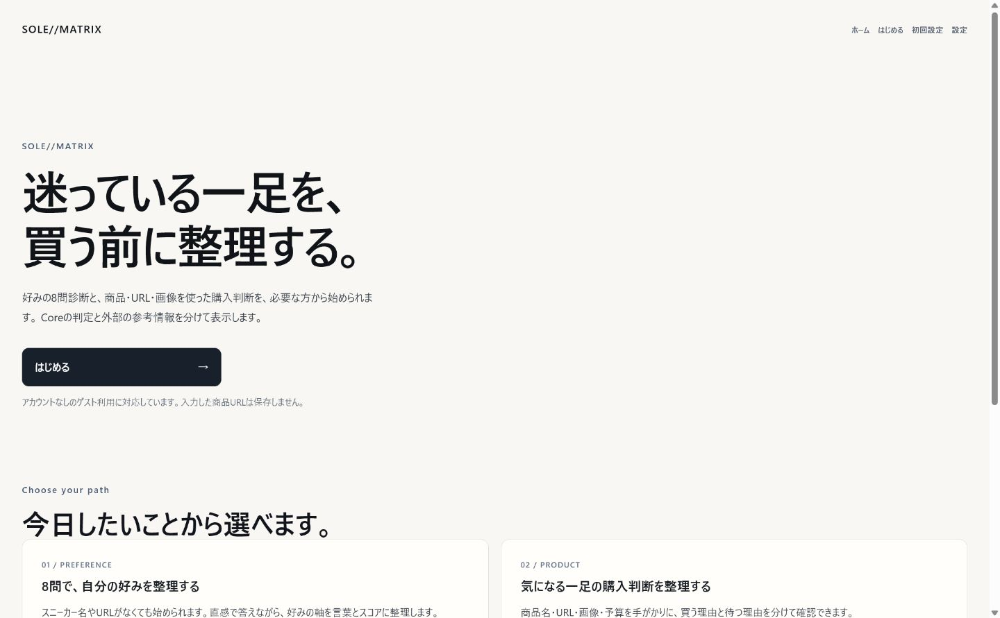
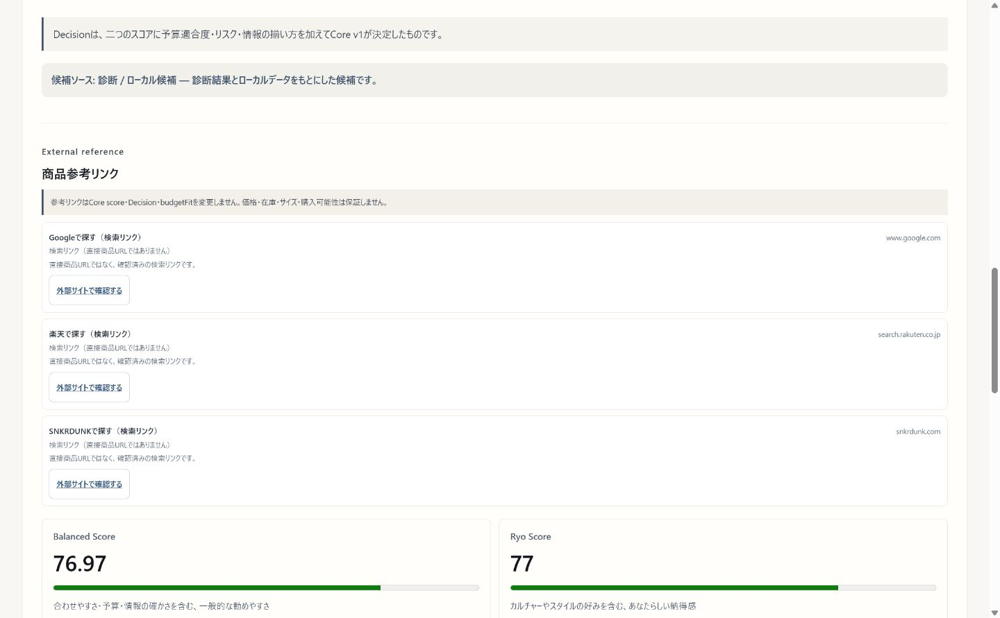
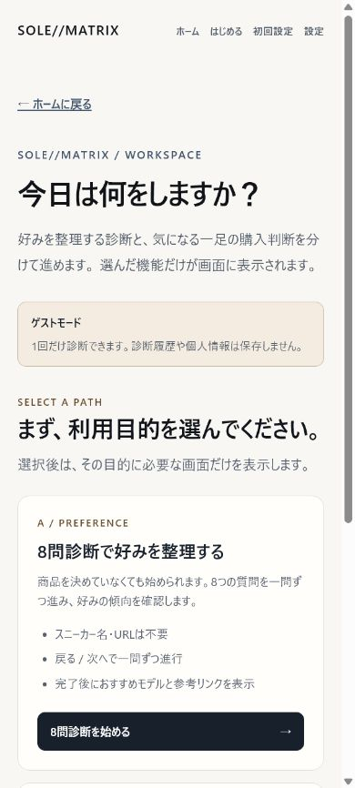
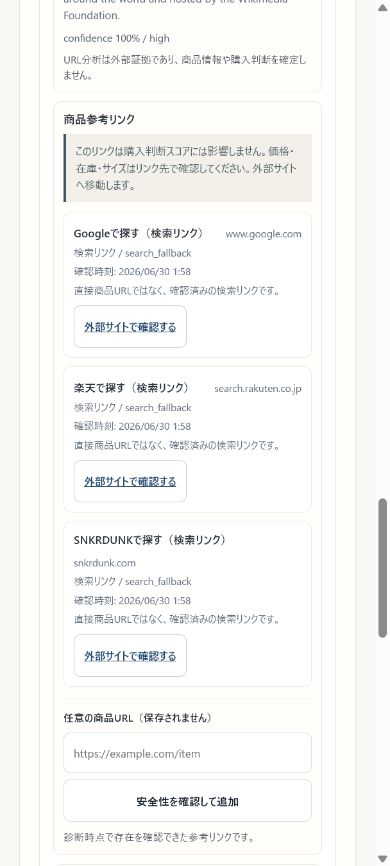

# SOLE//MATRIX Core v1

[](https://github.com/ryo-man03/sole-matrix-core/actions/workflows/ci.yml)

> **AI-powered sneaker recommendation platform.** Diagnosis, reproducible TypeScript Core, and clearly separated external evidence.

[Release Notes v1.1.1 Draft](docs/releases/v1.1.1.md) · [Release Notes v1.1.0](docs/releases/v1.1.0.md) · [Release Notes v1.0.0](docs/releases/v1.0.0.md) · [Architecture](docs/core-v1-architecture.md) · [Security](docs/security/all-in-one-security.md)

SOLE//MATRIX は、自分の好みをまだ言語化しきれない人が、スニーカー選びの軸を作るための判断支援プロダクトです。`/` → `/login` → `/app`の順に進み、現在利用できるゲスト入口から、8問診断または一足の商品判断を選びます。ログインと新規登録は本番認証前の準備中UIです。

最終的なscoreとDecisionはTypeScript Coreだけが決定します。Rakuten listing、Gemini画像分析、Gemini URL Context、共通feedback corpusは外部証拠として別表示され、Coreの候補・budgetFit・Decisionを変更しません。外部APIが失敗してもlocal候補とrule-based explanationへfallbackします。

## Product Preview

### PC




### Mobile




10画面の導線証跡と各画面の役割は[Screen Flow](docs/product/SCREEN_FLOW.md)にまとめています。

## 主な機能

- 8問回答を`PreferenceVector`の8軸へ変換
- `/` → `/login` → `/app`のproduct entry flowと、アプリ内モード選択
- mobile 1カラムからPC 3カラムまでのresponsive workspace
- guest 1回診断とlogin相当sessionの保存境界
- `Ryo Mode`と`Balanced Mode`の切り替え
- スニーカー名、商品URL、JPEG / PNG / WebP画像、予算の入力
- SSRF対策済みserver-side URL meta抽出
- Gemini画像・URL evidenceのstructured JSON正規化
- local user profileと`data/users/{safeUserId}/memory.md`
- 診断履歴、3択満足度feedback、匿名共通corpus
- 所有・wishlistと分離したRyo Mode curated recommendation seed
- Rakuten listingのserver-side取得、正規化、external evidence表示
- 推薦後にlive確認した外部商品・検索リンクの一時表示
- 8問診断後のおすすめモデル名と安全確認済み参考リンク
- 保存しない手動商品URLの安全確認
- Gemini structured explanationまたはrule-based fallback

## 判断の流れ

```text
/ → /login → guest → /appで利用目的を選択

8問診断
  → 8問を一問ずつ回答
  → user memory（untrusted user data）+ Ryo seed
  → local候補
  → Core v1 Balanced / Ryo score
  → mode evaluatorが最終Decision
  → Gemini explanation または rule-based fallback
  → 推薦モデル名をproduct-links resolverへ渡す
  → verified direct URLまたは「検索リンク」を参考情報として表示

商品判断（名前 / URL / 画像 / 予算）
  → external evidenceとして正規化
  → readiness・confidence・warningと共に別panelへ表示
  → Core候補・score・budgetFit・Decisionには不介入
  → 推薦結果後に商品参考リンクを表示

推薦商品名 / 検証済みRakuten listing URL
  → server-sideでpublic HTTP/HTTPS、redirect、HTTP statusをlive確認
  → verified liveまたは検索fallbackとして参考リンク欄へ表示
  → URLは保存せず、Core候補・score・budgetFit・Decisionには不介入

推薦後の満足度feedback
  → login相当userはmemoryへ保存
  → 匿名化した評価例は共通corpusへ保存
  → guestの個人memoryは保存しない
```

Ryo Modeは林諒馬の実所有41足、重複行を統合したwishlist 40候補、独立したcurated recommendation seedを参照し、colorway、collaboration、製造背景、同一familyの重複を評価します。Balanced Modeは価格、汎用性、情報の確かさ、サイズ・プレ値などの購入リスクを重視します。

## v1.1 Product-ready Beta (Draft)

### Who this is for

主な対象は、スニーカーに興味はあるが、自分の好み・手持ちとの相性・予算・買うタイミングを一人では整理しにくい学生や若い社会人です。詳しい人の感覚をそのまま押しつけるのではなく、再現可能な判断軸として渡します。

### How users start

トップから`/login`へ進み、現在利用できるguestを選びます。`/app?session=guest`では、8問診断と商品・URL・画像からの購入判断を最初に分けて選択します。選択後は該当機能だけを表示し、モード選択とホームへ戻れます。guestはbrowser内で8問診断または商品判断のどちらかを1回実行でき、個人memoryは永続化しません。`/onboarding`は任意の好みhint作成画面です。

### Login / Guest mode

ログインと新規登録はSupabase接続を想定した準備中UIであり、操作できる本番認証ではありません。guest識別子と診断済みflagはlocalStorage、onboardingの一時hintはsessionStorageに限定します。`/settings`からlogout、guest data削除、将来のaccount削除方針を確認できます。

### Responsive UI

workspaceは390px級のmobile 1カラムから始まり、1024px以上では入力・推薦・memory/evidenceの3カラムになります。主要操作はkeyboard focus、44px以上のbutton高、横overflowなしを基準にしています。

### Ryo Mode Curated Recommendation Seed

未購入でも人に勧めたい候補と推薦思想を、所有履歴・wishlist・user memoryから分離して管理します。boundedなRyo reference bonusにだけ使い、seed単独でDecisionを決めません。詳しくは[seed policy](docs/product/RYO_MODE_CURATED_SEED.md)を参照してください。

### External Evidence Layer

Rakuten listing、画像visual evidence、URL metadata / Gemini URL Context、匿名feedback patternsを一つのpanelへ集約します。各sourceはreadiness、confidence、warningを持ち、参考情報であることをUI上でも明記します。

### v1.1.1 Draft: Live product reference links

PR #5 adds live product reference links after the 8-question recommendation flow.

After a recommendation is generated, SOLE//MATRIX can show external reference links for the recommended model. These links are treated as external evidence only.

- Shows product reference links after the recommendation result
- Uses the displayed recommended product name for search fallback links
- Labels fallback links clearly as search links, not direct product pages
- Supports safe manual URL input after recommendation
- Removes sensitive or tracking query parameters such as `access_key`, `api_key`, `token`, `utm_*`, and `ref`
- Blocks unsafe URLs such as `javascript:`, `data:`, `file:`, `ftp:`, localhost, private IPs, and tunnel URLs
- Keeps product URLs separate from Core Decision, score, and budgetFit

Boundary:

Product reference links do not guarantee price, inventory, size availability, or the cheapest purchase option.
They do not change the recommendation score or purchase decision.
If a direct product page cannot be verified, the UI may show a clearly labelled search fallback link instead.

### Global Recommendation Feedback Corpus

3択の満足度と任意理由から、個人識別子を含まない評価例をruntime corpusへ追記します。自由記述のemail・phone・URLは伏せ、AIへの命令ではなくuntrusted referenceとして扱います。詳しくは[corpus policy](docs/product/GLOBAL_RECOMMENDATION_FEEDBACK.md)を参照してください。

### Rakuten / Gemini policy

Rakutenは商品listingの外部証拠、Geminiは説明・画像特徴・公開URL文脈の補助です。API key、query全文、key入りrequest URL、raw responseをログ・UI・corpusへ出しません。どちらもTypeScript CoreのscoreまたはDecisionを決定しません。

### User satisfaction feedback

推薦後に「満足」「一部満足」「不満」の3択と任意理由を受け付けます。login相当userのfeedbackは個人memory、guestの個人feedbackはsession内、匿名化した評価例は共通corpusという境界で扱います。

## セットアップ

Node.js、pnpm、Gitが必要です。

```bash
pnpm install
pnpm web:dev
```

通常は[http://localhost:3000](http://localhost:3000)で起動します。外部APIを設定しなくても推薦本線は動作します。

`.env.example`を`.env.local`へコピーし、必要な値だけ設定します。本物の値はcommitしません。

```env
GEMINI_API_KEY=your_api_key_here
RAKUTEN_APPLICATION_ID=your_application_id_here
RAKUTEN_ACCESS_KEY=your_access_key_here
BACKEND_API_BASE_URL=http://localhost:8787
RUN_EXTERNAL_SMOKE=
```

現在のNext.js一体構成では`BACKEND_API_BASE_URL`は省略できます。将来`server/`境界を別プロセスへ移す場合の接続先です。秘密値を`NEXT_PUBLIC_*`へ入れないでください。

## API

| Method / path | 用途 |
| --- | --- |
| `POST /api/users/register` | local user登録 / `memory.md`作成 |
| `GET /api/users/:userId/profile` | profile・履歴summary取得 |
| `POST /api/users/:userId/feedback` | feedback永続化 |
| `POST /api/recommendation-feedback` | 匿名共通corpusへの安全な追記 |
| `POST /api/sneakers/analyze` | 名前・URL・画像の統合分析 |
| `POST /api/recommendations/search` | mode-aware統合推薦 |
| `POST /api/product-links/resolve` | 推薦後・手動URLのlive確認（非永続） |
| `POST /api/core-v1/recommend` | 既存Core v1互換endpoint |

`/api/sneakers/analyze`は`multipart/form-data`で`sneakerName`、`url`、`image`を受け取ります。画像は5MB以下のJPEG / PNG / WebPだけを許可し、永続保存しません。

## URL分析の安全境界

- `http` / `https`以外、credential入りURL、非標準portを拒否
- localhost、private / link-local / reserved IPを拒否
- DNS解決結果と各redirect先を再検証
- 5秒timeout、redirect 3回、HTML 512KB上限
- title、description、Open Graph、canonicalだけを抽出
- cookie、API key、raw HTMLを送信・保存・表示しない
- 失敗時はURL情報なしで推薦を継続

商品参考リンクも同じSSRF境界を再利用し、各redirect先を再検証します。表示前にHTTP statusを確認し、tracking、affiliate、token系queryとfragmentを除去します。blocked / not-found URLはリンクにせず、検索URLは直接商品URLと区別します。

## 画像分析とGeminiの役割

画像はMIME typeだけでなくmagic bytesも検証します。Geminiに許可するのはbrand / model推定、色、素材、シルエット、category、雰囲気、文化的文脈です。Geminiが返す定性的signal（none / low / medium / high）をTypeScriptがvisual scoreへ変換します。

Geminiは以下を決めません。

- 最終Decision
- Balanced / Ryo recommendation score
- 価格の真偽
- 真贋の断定

schema不一致、禁止field、通信失敗、設定不足ではstructured fallbackへ戻ります。説明生成でもCore確定済みfactsだけを渡し、`memory.md`は`untrusted_user_data`として明示します。

## 楽天候補とfallback

検索queryは名前・brand・color・URL name hintから短く生成します。listing採用にはHTTP 200、JSON parse、shape validation、商品名、正の価格、安全なHTTPS URLが必要です。不正itemはrawのままUIへ渡しません。有効なlistingもCore candidate setへ入れず、価格はbudgetFitへ使わず、external evidence panelだけへ表示します。

| 状態 | 動作 |
| --- | --- |
| HTTP 200 + valid listing | external evidence panelへ表示。Core Decisionは不変 |
| `missing_config` | local候補で継続 |
| HTTP 403 | `blocked_forbidden`、local候補で継続 |
| HTTP 429 | `blocked_rate_limit`、local候補で継続 |
| 通信 / HTTP失敗 | `network_or_http_error`、local候補で継続 |
| invalid response | `invalid_response`、local候補で継続 |

## User memory

ユーザーIDは1〜64文字の英数字・ハイフン・アンダースコアだけを許可します。`../`、絶対path、空白、日本語ID、symlink境界を拒否します。runtime dataは`.gitignore`対象です。

```text
data/users/{safeUserId}/memory.md
```

自由文は制御文字と改行を正規化し、URL-like値を伏せてJSON文字列として保存します。AIへ渡す場合もsystem instructionにはせず、ファイル内の命令文には従いません。

## 検証

通常検証は実ネットワークを呼びません。

```bash
pnpm exec vitest run
pnpm test
pnpm exec tsc --noEmit
pnpm web:build
```

lint scriptと独立server build scriptは現在ありません。`server/**/*.ts`はTypeScriptとNext production buildで検証します。外部smokeは`RUN_EXTERNAL_SMOKE=1`の明示opt-in時だけ実行します。

```powershell
$env:RUN_EXTERNAL_SMOKE = "1"
pnpm exec vitest run app/_lib/external-smoke app/_lib/core-v1/geminiActualSmoke.test.ts --disableConsoleIntercept --reporter=verbose
Remove-Item Env:RUN_EXTERNAL_SMOKE -ErrorAction SilentlyContinue
```

値、request URL、query全文、raw responseは出力しません。

## 主なディレクトリ

```text
app/_components/RecommendationWorkspace.tsx   商品・URL・画像判断workspace
app/_components/ProductSessionBoundary.tsx    session / モード選択境界
app/_components/PreferenceDiagnosisFlow.tsx   独立した8問診断
app/_lib/core-v1/                             score / Decision / providers
app/_lib/url-analysis/                        safe URL analysis
app/_lib/product-links/                       live URL verification / resolver
app/_lib/image-analysis/                      image validation / vision adapter
app/_lib/user-memory/                         memory.md persistence
app/_lib/auth-session/                        login相当 / guest session boundary
app/_lib/external-evidence/                    Rakuten / image / URL evidence view model
app/_lib/recommendation-feedback/              satisfactionと匿名corpus
app/_lib/integrated-recommendation/           mode-aware orchestration
app/_lib/apiClient.ts                         frontend API boundary
app/api/                                      Next.js transport routes
server/routes/                                backend route boundary
server/services/                              backend service boundary
data/users/                                   ignored runtime user data
data/recommendation-feedback/                 ignored runtime corpus + synthetic example
```

設計と検証の詳細は[architecture](docs/core-v1-architecture.md)と[security notes](docs/security/all-in-one-security.md)を参照してください。

## 画面証跡

PC 1440pxとmobile 390pxで、ホーム、入口、モード選択、8問診断結果、商品判断結果を`docs/screenshots/flow-*.png`へ保存しています。詳細は[Screen Flow](docs/product/SCREEN_FLOW.md)を参照してください。既存Core v1の過去証跡も`docs/screenshots/`に残しています。

## できること

- ログイン / 新規登録 / ゲストの入口状態を確認し、ゲストで開始する
- 8問診断で好みを整理し、おすすめモデル名と商品参考リンクを確認する
- 商品名・URL・画像・予算から購入判断材料を整理する
- 入力URLを外部参考情報として扱い、metadata・confidence・warningを確認する
- 直接商品URLを確認できない場合、「検索リンク」と明記したfallbackを使う
- Core Decision / score / budgetFitと外部証拠を分離する

## できないこと・制限

- ログイン / 新規登録の本番認証とaccount削除は未実装です
- 価格比較、在庫・サイズ確認、最安値、購入可能性を保証しません
- 真贋判定は行いません
- 全商品に直接商品URLが見つかることは保証しません
- Rakuten listing、Gemini、AI説明、外部URLはCore判断を直接決定しません
- 別server化は境界までで、現在はNext.js process内です

## 今後の発展

- Supabase等による本番認証とユーザー別診断履歴
- 楽天以外の正式providerと、安全な価格推移・在庫・サイズ情報
- おすすめモデルURLと画像分析の精度向上
- スマホ導線の短縮と発表用デモモード

```bash
pnpm demo
pnpm demo:gemini
```
