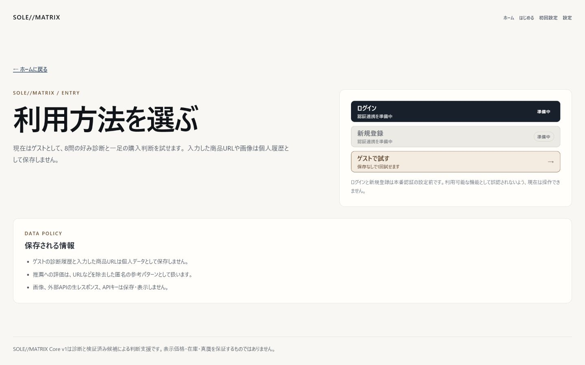
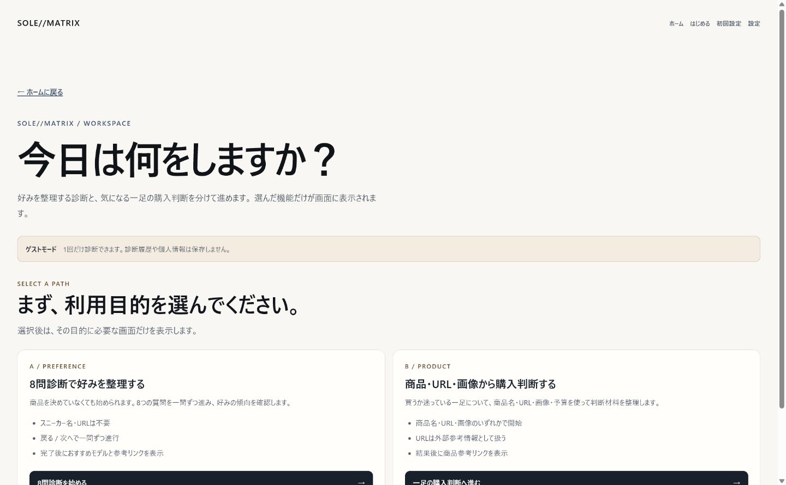
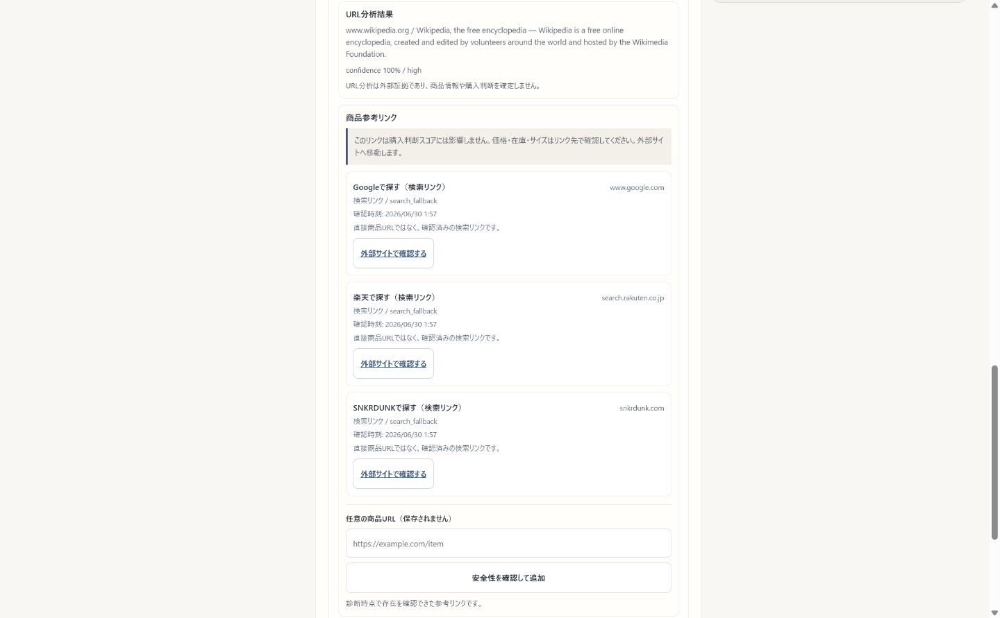
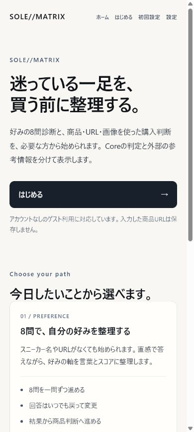
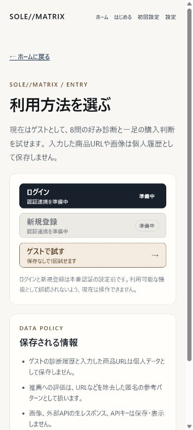
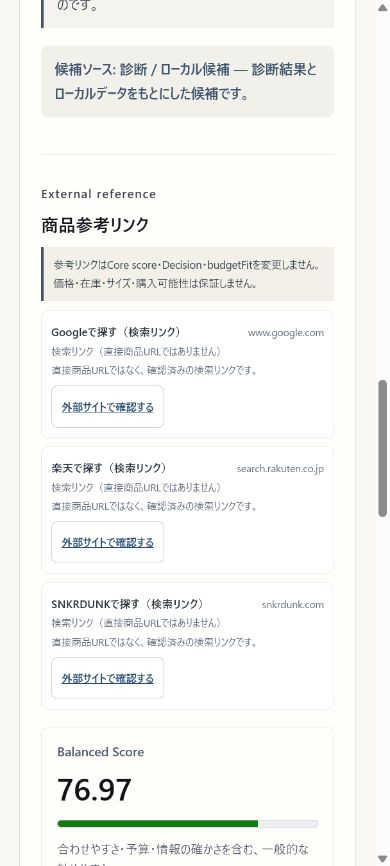

# Screen Flow

## Current route flow

```text
/
  → /login
    → /app?session=guest
      → 8問診断
        → おすすめモデル + 商品参考リンク
      → 商品・URL・画像判断
        → Core判断 + 外部参考情報 + 商品参考リンク
```

`/`はランディングだけを表示します。`/login`のログインと新規登録は本番認証前の準備中UIで、現在操作できる入口はゲストです。`/app`では最初に利用目的を選び、8問診断と商品判断を同時表示しません。各モードからモード選択とホームへ戻れます。

## PC — 1440px

### 1. Landing


### 2. Login / guest entry



### 3. Mode select



### 4. Diagnosis result and reference links


### 5. Product judgment and reference links



## Mobile — 390px

### 1. Landing



### 2. Login / guest entry



### 3. Mode select


### 4. Diagnosis result and reference links



### 5. Product judgment and reference links


## URL display boundary

- 推薦モデル名はCore / 既存推薦ロジックが決めます。
- product-links resolverだけがdirect URLのpublic HTTP/HTTPS、DNS、redirect、HTTP statusを確認します。
- direct URLを確認できない場合は「検索リンク」と明記します。
- 表示前にtracking、affiliate、token、credential系queryとfragmentを除去します。
- blocked / not-found URLはlink buttonにしません。
- 外部リンクは`target="_blank"`と`rel="noopener noreferrer"`を使用します。
- URLはCore Decision、score、`budgetFit`を変更せず、user memoryやglobal feedback corpusへraw保存しません。
- 価格、在庫、サイズ、最安値、購入可能性を保証しません。

## Browser QA — 2026-06-30

- `/` → `/login` → `/app?session=guest`の遷移: passed
- 8問診断、モデル名、検索fallback表示: passed
- 商品名・URLによる商品判断と参考リンク表示: passed
- `https://www.wikipedia.org/`: external evidenceとして表示
- token / tracking query付きURL: raw queryをUIから除去、safe URLと同じCore scoreを維持
- `javascript:alert(1)`: URL evidenceで拒否理由を表示し、危険linkを生成しない
- manual unsafe URL: 「安全な公開HTTP/HTTPS URLではありません」と拒否
- 390 / 500 / 768 / 1024 / 1440px: horizontal overflowなし
- 主要操作領域: 44px以上
- console / hydration / runtime error: 0

## Product status

### できること

- 8問診断と商品判断を別々に開始する
- 診断結果からおすすめモデルと参考リンクを確認する
- URLを外部参考情報として確認し、失敗してもCore推薦を継続する
- 商品判断後にdirect URLまたは検索fallbackを確認する

### できないこと

- 本番ログイン / 新規登録
- 価格比較、在庫・サイズ・最安値・購入可能性の保証
- 真贋判定
- すべての商品に対するdirect URLの保証

### 今後の発展

- 本番認証とユーザー別履歴
- provider追加と安全な価格・在庫・サイズ情報
- URL解決と画像分析の精度改善
- さらに短いmobile導線と発表用デモモード
